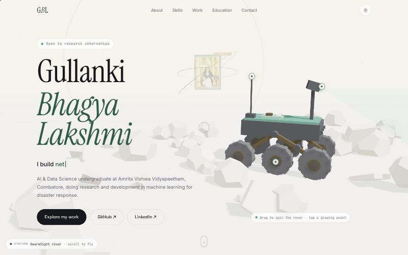

# Gullanki Bhagya Lakshmi · Portfolio

**Live site → [gullanki-06.github.io/Portfolio](https://gullanki-06.github.io/Portfolio/)**

[](https://gullanki-06.github.io/Portfolio/)

AI & Data Science undergraduate at Amrita Vishwa Vidyapeetham, Coimbatore (CGPA 8.18), doing research and development in machine learning for disaster response.

[LinkedIn](https://www.linkedin.com/in/gullankibhagyalakshmi/) · [Email](mailto:gullankibhagyalakshmi@gmail.com)

## What's inside

An interactive 3D portfolio. Scrolling flies a camera through a 3D world with a stop for each section.

- **SwarmSight rover**: a 3D model of her search-and-rescue robot. Drag to spin it, and tap the glowing points to open the related project.
- **Fly-through stations**: a framed portrait, a skills cluster, a protein double helix, a graduation cap and a signal tower.
- **Details**: light and dark themes, 3D tilt cards, project filters, a custom cursor and a mobile layout. If WebGL is unavailable, the page falls back to a simpler version.

## Projects featured

| Project | Area | Tech |
|---|---|---|
| SwarmSight: Vision-Based Search & Rescue Robot | Robotics, Computer Vision | YOLO11n, Raspberry Pi 5, NCNN |
| Adaptive PSO for Multi-Robot Search & Rescue | Swarm Intelligence | Particle Swarm Optimisation, Python |
| Mission-Aware Continual Learning for SDR Emergency Networks | Networks, Continual Learning | GNU Radio, SDR, Online Learning |
| AI Complaint Intelligence | NLP, Decision Support | TF-IDF, SVM, Streamlit |
| Protein Secondary Structure Prediction | Computational Biology | Python, Machine Learning |
| YOLO-based Theft Detection | Computer Vision | YOLO, Deep Learning |

## Built with

Plain HTML, CSS and JavaScript, with [Three.js](https://threejs.org/) for the 3D scene. There is no build step, and GitHub Pages hosts it directly from `main`.

## Run locally

```bash
git clone https://github.com/gullanki-06/Portfolio.git
cd Portfolio
python3 -m http.server 5173
# open http://localhost:5173
```

## Files

```
index.html   page content
styles.css   theme, layout and animations
script.js    interactions (cursor, tilt, filters, counters, theme toggle)
scene.js     3D world, rover and camera fly-through
assets/      photo and preview image
```
